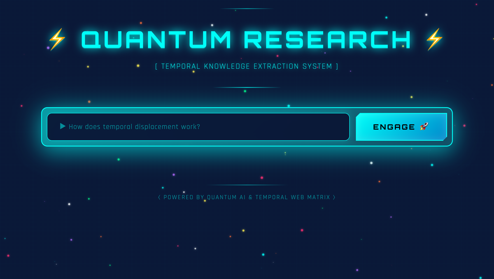
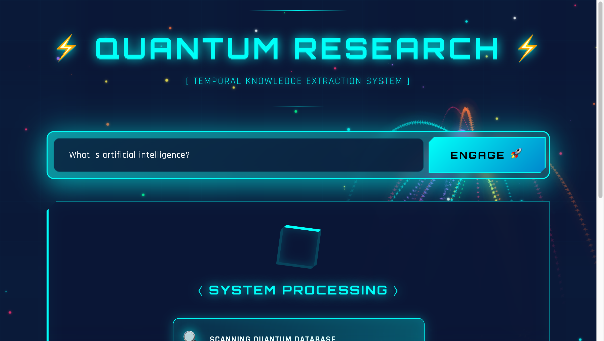
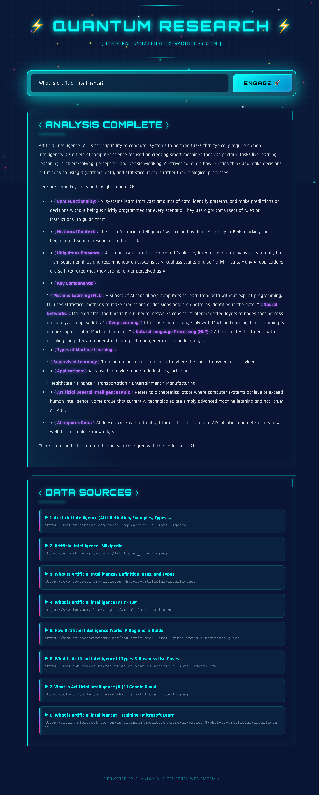

# 🛸 Quantum Research Terminal - AI Research Assistant

An alien spacecraft-themed web application that researches multiple websites using DuckDuckGo and generates clear, concise answers using **its own self-trained AI model** + Google's Gemini AI.


## ✨ Features

### 🧠 **NEW: Self-Learning AI Model**
- **Trains 24/7**: Custom LSTM neural network that learns continuously in the background
- **Web-Powered Learning**: Automatically scrapes and learns from the web autonomously
- **Smart Switching**: Starts with Gemini, auto-switches to local model when trained
- **Grammar Polishing**: Uses Gemini to correct grammar until model is fully independent
- **Real-Time Status**: See training progress (examples, quality %) in the UI
- **Your Own AI**: No external API calls once trained - fully private and fast!

### 🔍 **Core Features**
- 🔍 **Automated Web Research**: Searches DuckDuckGo for relevant information (no API key needed!)
- 📄 **Multi-Site Scraping**: Extracts content from multiple websites simultaneously
- 🤖 **Dual AI System**: Gemini API + Custom self-trained neural network
- 🛸 **Alien Spacecraft UI**: Futuristic interface with angular design and cyan glow aesthetic
- 📚 **Source Citations**: Shows all sources used with clickable links
- 🎨 **Static Starfield**: Beautiful background with 100 static stars
- ⚡ **Optimized Performance**: Smooth, lag-free experience

## 📸 Screenshots

### Main Interface

*Alien spacecraft control panel with search input and static starfield*

### Processing State

*System processing with animated loading steps*

### Results Display

*AI-generated answer with source citations*

## 🎨 Design Philosophy

The interface is designed to look like an **alien spacecraft control panel**:
- ✅ Angular, geometric shapes (hexagonal cut corners)
- ✅ Deep blue space backgrounds
- ✅ Cyan/blue neon accents
- ✅ Tech grid overlays
- ✅ No animations (100% static for clarity)
- ✅ Sharp, futuristic aesthetic

## 📋 Prerequisites

- Python 3.9 or higher
- pip (Python package manager)
- Internet connection

---

## ⚡ **ONE-LINE START (Copy & Paste)**

After installing dependencies, use this command to start everything:

```bash
cd "/Users/rishi/reserch ai" && source venv/bin/activate && python -u background_trainer.py > training.log 2>&1 & python app.py &
```

Then open: **http://localhost:8080**

---

## 🚀 Quick Start

### 1. Clone the Repository

```bash
git clone https://github.com/rszirpe/reaserch-ai.git
cd reaserch-ai
```

### 2. Create Virtual Environment

```bash
python3 -m venv venv
source venv/bin/activate  # On Windows: venv\Scripts\activate
```

### 3. Install Dependencies

```bash
pip install -r requirements.txt
```

### 4. Configure API Key

The Google Gemini API key is already configured in `config.py`. If you want to use your own:
1. Get a free API key from [Google AI Studio](https://makersuite.google.com/app/apikey)
2. Replace the API key in `config.py`

### 5. Start Both Services

**Option A: Quick Start (Recommended)**
```bash
# Start background trainer (24/7 learning)
python -u background_trainer.py > training.log 2>&1 &

# Start Flask app (web interface)
python app.py &
```

**Option B: Copy-Paste One-Liner (Use This!)**
```bash
cd "/Users/rishi/reserch ai" && source venv/bin/activate && python -u background_trainer.py > training.log 2>&1 & python app.py &
```

### 6. Access the Interface

Open your browser: **http://localhost:8080**

## 🎮 How It Works

### Initial Phase (First Few Hours)
1. **Background Trainer** starts learning from the web 24/7
2. You can use the app immediately - **Gemini API handles requests**
3. Watch the training status in the **top-right corner**:
   ```
   [TRAINING: 150 examples | Quality: 0%]
   ```

### Training Phase (Days 1-7)
1. Model trains continuously, even when you're not using it
2. Quality score gradually increases: 25% → 50% → 75%
3. Still uses Gemini for all answers (seamless for you!)

### Auto-Switch (When Quality ≥ 85%)
1. **App automatically switches to your local model!**
2. Status changes to:
   ```
   [LOCAL AI: Quality 87% ✓]
   ```
3. Gemini still polishes grammar for professional output
4. Faster responses (no API latency!)

### Expert Mode (When Grammar ≥ 90%)
1. **Fully independent!** No Gemini needed at all
2. Status shows:
   ```
   [EXPERT MODE: 100% Independent 🧠]
   ```
3. 100% private, 100% free, 100% yours!

### How to Use

1. Enter your research question in the search box
2. Click the **ENGAGE** button
3. Wait 10-30 seconds while the app:
   - Searches DuckDuckGo for relevant websites
   - Scrapes content from multiple sources
   - Generates answer (Gemini or local model based on training status)
4. Review the AI-generated answer and check the cited sources

## 🧠 Self-Learning AI Details

### What Makes It Special?
- **Autonomous**: Learns from the web without any supervision
- **Continuous**: Trains 24/7, even when you're sleeping
- **Privacy-First**: Once trained, no data leaves your computer
- **Cost-Free**: Eventually eliminates all API costs
- **Custom**: Adapts to your research style and topics

### Architecture
- **Model**: LSTM Seq2Seq with Attention
- **Vocabulary**: 30,000 words
- **Parameters**: ~15M (lightweight, runs on CPU)
- **Training**: Unsupervised learning from scraped web data
- **Database**: SQLite for training examples
- **Framework**: PyTorch

### Background Processes
1. **`background_trainer.py`**: 
   - Generates random research topics
   - Scrapes web content
   - Trains neural network
   - Saves checkpoints every 100 steps
   - Runs forever (restart after reboot - see `RESTART_GUIDE.md`)

2. **`app.py`**:
   - Serves web interface
   - Routes to Gemini or local model
   - Provides real-time training status
   - Manages quality evaluation

## 📝 Example Queries

- "What are the latest developments in AI?"
- "How does quantum computing work?"
- "What is blockchain technology?"
- "Benefits of meditation"
- "Future of space exploration"

## 🛠️ Technology Stack

### AI & Machine Learning
- **PyTorch** - Neural network framework
- **Custom LSTM** - Seq2Seq architecture with attention
- **Word-Level Tokenizer** - 30K vocabulary
- **SQLite** - Training data management
- **Google Gemini 2.0 Flash** - Initial answers + grammar correction

### Backend
- **Flask** - Web framework
- **BeautifulSoup4** - Web scraping
- **Requests** - HTTP library
- **DuckDuckGo HTML Search** - Free search (no API key needed)
- **ThreadPoolExecutor** - Concurrent web scraping

### Frontend
- **HTML5** - Structure
- **CSS3** - Styling (glassmorphism, angular design)
- **Vanilla JavaScript** - Interactivity + real-time status updates
- **Canvas API** - Static starfield background

### Fonts
- **Orbitron** - Headers (futuristic sci-fi font)
- **Rajdhani** - Body text (clean tech font)

## 📁 Project Structure

```
reaserch-ai/
├── app.py                      # Flask backend server
├── background_trainer.py       # 24/7 AI training script
├── config.py                   # Configuration settings
├── requirements.txt            # Python dependencies
├── README.md                   # This file
├── START_TRAINING.md          # Training guide
├── RESTART_GUIDE.md           # How to restart after reboot
├── model/
│   ├── __init__.py
│   ├── neural_network.py      # LSTM Seq2Seq architecture
│   ├── tokenizer.py           # Word-level tokenizer
│   ├── trainer.py             # Training loop
│   ├── data_manager.py        # SQLite database manager
│   ├── autonomous_learner.py  # Web scraping for training
│   ├── quality_checker.py     # Model evaluation
│   ├── grammar_corrector.py   # Gemini grammar polishing
│   ├── training_data.db       # Training examples (generated)
│   ├── vocab.pkl              # Vocabulary (generated)
│   └── checkpoints/           # Model weights (generated)
│       └── best_model.pt
├── static/
│   ├── index.html             # Frontend interface
│   ├── style.css              # Alien spacecraft styling
│   └── script.js              # Frontend logic + status updates
└── venv/                      # Virtual environment (not in repo)
```

## 🎨 UI Features

### Alien Spacecraft Design Elements
- **Angular Cards**: All panels have cut corners (clip-path polygons)
- **Cyan Glow**: Consistent #00fff9 color scheme throughout
- **Tech Borders**: 4px left borders on cards for emphasis
- **Grid Overlays**: Subtle tech grid patterns on background
- **Static Stars**: 100 non-moving stars for clean aesthetic
- **Glassmorphism**: Frosted glass effect with backdrop blur

### Color Palette
- **Primary Background**: `#0a1535` (Deep blue)
- **Starfield Gradient**: `#1a2f5c` → `#0a1535`
- **Accent Color**: `#00fff9` (Cyan)
- **Text**: `#ffffff` (White)
- **Glass Overlays**: `rgba(10, 21, 53, 0.9)`

## ⚙️ Configuration

### Change Port
If port 8080 is in use, modify `app.py` line 200:
```python
app.run(debug=True, port=YOUR_PORT)
```

Also update `static/script.js` line 2:
```javascript
const API_URL = 'http://localhost:YOUR_PORT';
```

### Adjust Search Results
Modify the number of websites scraped in `app.py` line 165:
```python
search_results = search_duckduckgo(query, max_results=8)  # Change 8 to your preferred number
```

## 🐛 Troubleshooting

### Port Already in Use
```bash
# Find and kill the process using port 8080
lsof -ti:8080 | xargs kill -9
```

### Module Not Found Errors
```bash
pip install -r requirements.txt
```

### Training Shows "STATUS OFFLINE"
The Flask app stopped but the trainer is still running. Restart Flask:
```bash
cd "/Users/rishi/reserch ai"
source venv/bin/activate
python app.py &
```

### Check Training Progress
```bash
# See live training log
tail -f training.log

# Check model status
curl http://localhost:8080/model-status
```

### After Computer Restart
Both processes stop when you restart. See `RESTART_GUIDE.md` for full instructions, or run:
```bash
cd "/Users/rishi/reserch ai" && source venv/bin/activate && python -u background_trainer.py > training.log 2>&1 & python app.py &
```

### Multiple Trainers Running
```bash
# Kill all background trainers
pkill -f background_trainer

# Start just one
python -u background_trainer.py > training.log 2>&1 &
```

### Rate Limit from Gemini API
Wait 30-60 seconds between requests. The free tier has rate limits.

### Browser Shows Cached Version
- **Hard Refresh**: `Cmd/Ctrl + Shift + R`
- **Clear Cache**: Open DevTools → Network tab → Disable cache
- **Private Window**: Use incognito/private browsing

## 🔒 Security Notes

- The Gemini API key is included for demo purposes
- For production, use environment variables:
  ```python
  import os
  GEMINI_API_KEY = os.getenv('GEMINI_API_KEY')
  ```
- The app scrapes public websites responsibly with timeouts
- CORS is enabled for local development

## 📊 Performance

- **Stars**: 100 static particles (optimized for performance)
- **Search Results**: 8 websites scraped concurrently
- **Timeout**: 5 seconds per website
- **Response Time**: 10-30 seconds average
- **No Animations**: 100% static for zero lag

## 🤝 Contributing

Contributions are welcome! Please feel free to submit a Pull Request.

## 📄 License

This project is open source and available under the MIT License.

## 🙏 Acknowledgments

- **Google Gemini AI** - For the AI text generation
- **DuckDuckGo** - For free, privacy-focused search
- **Flask Community** - For the excellent web framework
- **Google Fonts** - For Orbitron and Rajdhani fonts

## 📧 Contact

Created by Rishi - [@rszirpe](https://github.com/rszirpe)

---

**⚡ QUANTUM RESEARCH TERMINAL - OPERATIONAL ⚡**

*Navigate the web at the speed of thought* 🛸
